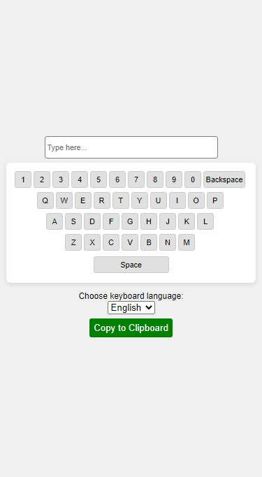

# Keyboard Visualization

A dynamic virtual keyboard application that allows users to type in multiple languages (English, Persian, Pashto) using a graphical interface. The app features a customizable keyboard layout, clipboard functionality, and an interactive user experience.

## Screenshot

## Links

- [Live Demo](https://mahmoodhashem.github.io/JavaScript-Projects/Projects/keyboard-visualizer/index.html)

## Features

- **Interactive Buttons**: Buttons change appearance when clicked, enhancing user experience.
- **Multi-language Support**: Switch between English, Persian, and Pashto keyboard layouts.
- **Dynamic Keyboard Rendering**: The keyboard layout updates based on user selection.
- **Copy to Clipboard**: Easily copy text from the input field to the clipboard.
- **Backspace Functionality**: Remove the last character typed with a dedicated backspace button.
- **Responsive Design**: The app is designed to work well on both desktop and mobile devices.

## What I Learned

- The use of JavaScript event listeners for **mouse and keyboard events.**
- Implementing the **Clipboard API** for copying text and handling cross-browser compatibility.
- **Structuring data** in JavaScript for multi-language support..
- The importance of error handling and user feedback in web applications.
